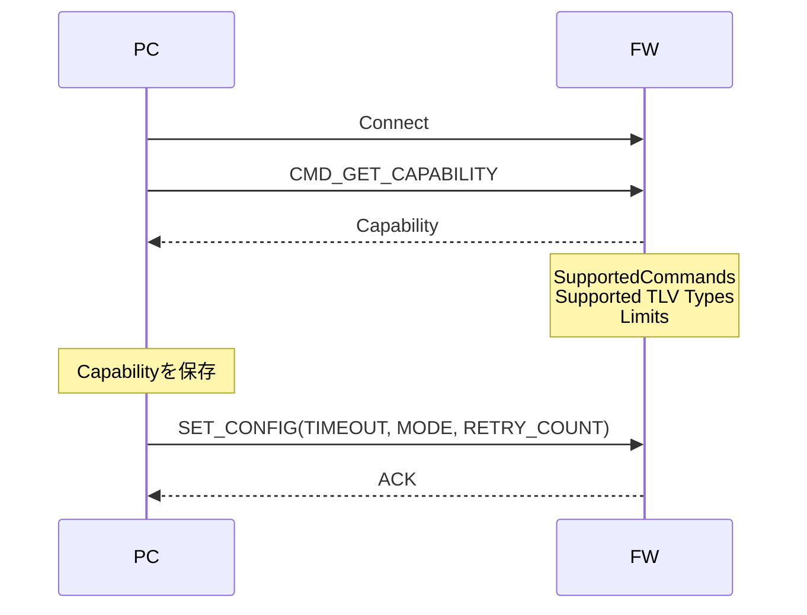
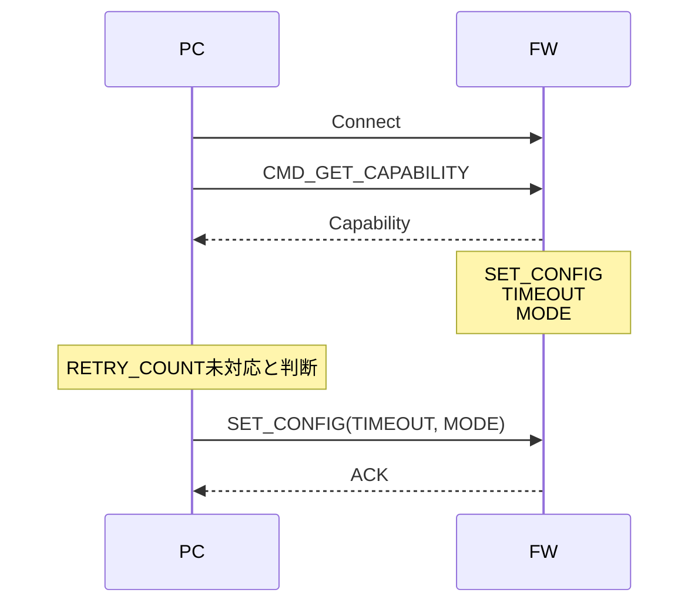
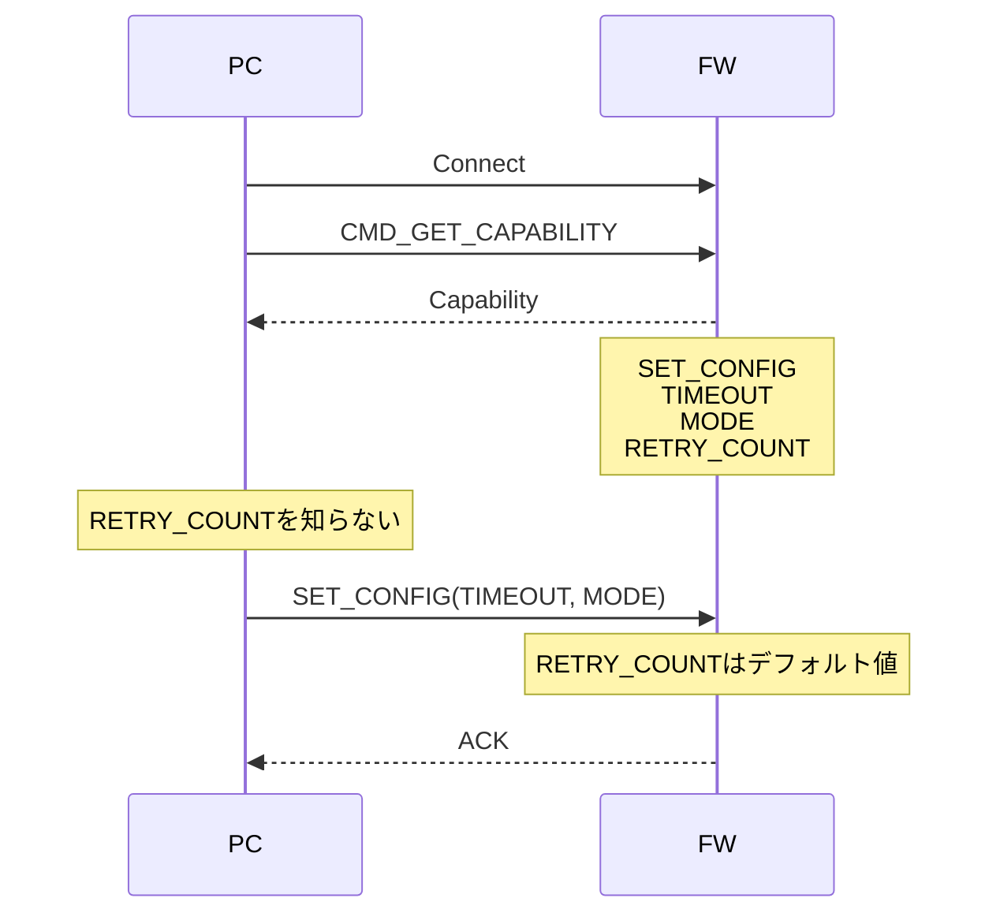

# 1. Purpose

本仕様は、PCソフトウェアとファームウェア間の通信プロトコルを定義する。

本プロトコルは以下を目的とする。

- PCとファームウェアを独立して更新可能とする
- 新旧バージョンの組み合わせでも動作可能とする
- コマンド仕様の長期的な拡張を容易にする
- 高速通信ではオーバーヘッドを最小限にする

---

# 2. Design Principles

本プロトコルでは、プロトコル全体のバージョン管理は行わない。

以下を設計原則とする。

- パケットフォーマットは変更しない
- Header構造は変更しない
- エンディアンはリトルエンディアン固定
- コマンド仕様は後方互換を維持しながら拡張する
- Capabilityによって相手機能を判定する

---

# 3. Packet Format

```
+------------+---------------+----------+
| Command ID | Payload Length| Payload  |
+------------+---------------+----------+
```

| Field | Description |
|--------|-------------|
| Command ID | コマンドID |
| Payload Length | Payloadサイズ(Byte) |
| Payload | コマンド固有データ |

数値データはすべてリトルエンディアンとする。

文字列データはASCIIまたはUTF-8とし、エンディアン変換は行わない。

---

# 4. Payload Format

コマンドは以下の2種類のPayload形式を使用する。

## 4.1 Fixed Structure

高速通信を目的としたコマンド。

対象例

- Measurement
- Streaming
- Binary Data
- Image Transfer

特徴

- 固定構造体
- パースが高速
- PayloadLengthで後方互換を実現

例

Version1

```c
typedef struct
{
    uint32_t channel;
    uint32_t count;
} MeasureRequest;
```

Version2

```c
typedef struct
{
    uint32_t channel;
    uint32_t count;
    uint32_t option;
} MeasureRequest;
```

### 拡張ルール

- フィールド追加は末尾追加のみ
- フィールド削除禁止
- フィールド順変更禁止

FWはPayloadLengthまでを解釈する。

存在しないフィールドはデフォルト値を使用する。

---

## 4.2 TLV Structure

仕様変更が多いコマンドに使用する。

対象例

- Capability
- Get Configuration
- Set Configuration
- Device Information
- Diagnostic

形式

```
+------+--------+------+
| Type | Length | Data |
+------+--------+------+
```

| Field | Description |
|--------|-------------|
| Type | パラメータID |
| Length | Data長 |
| Data | 値 |

例

```
Type   = TIMEOUT
Length = 4
Value  = 100

Type   = MODE
Length = 1
Value  = 2

Type   = RETRY_COUNT
Length = 2
Value  = 10
```

### 拡張ルール

- Type追加は自由
- 未知TypeはLengthを利用してスキップする
- Typeの意味は変更しない

---

# 5. Capability

接続直後にCapabilityを取得する。

```
CMD_GET_CAPABILITY
```

Capability自体もTLV形式とする。

取得内容例

- Supported Commands
- Supported TLV Types
- Device Information
- Limits

---

## 5.1 Supported Commands

例

```
START_MEASURE
STOP_MEASURE
READ_LOG
SET_CONFIG
GET_CONFIG
```

---

## 5.2 Command Capability

TLV形式のコマンドについて、
サポートしているType一覧を返す。

例

```
Command = SET_CONFIG

Supported Types

TIMEOUT
MODE
RETRY_COUNT
AUTO_RESET
```

```
Command = START_MEASURE

Supported Types

TRIGGER
TIMESTAMP
AVERAGE
```

PCはCapabilityを参照し、
対応しているTypeのみ送信する。

---

## 5.3 Limits

例

```
MAX_PAYLOAD_SIZE

MAX_CHANNEL

MAX_LOG_SIZE

MAX_FILE_SIZE
```

---

# 6. Sending Rule (PC)

PC内部では常に最新のデータモデルを保持する。

送信時はCapabilityを参照し、

相手FWがサポートするTLV Typeのみ送信する。

例

PC内部

```
Timeout
Mode
RetryCount
AutoReset
```

Capability

```
Timeout
Mode
RetryCount
```

送信

```
Timeout
Mode
RetryCount
```

AutoResetは送信しない。

---

# 7. Receiving Rule (FW)

## Fixed Structure

- PayloadLengthまでを解析する
- 存在しないフィールドはデフォルト値を使用する

## TLV

- 未知TypeはLengthを利用してスキップする
- 未対応Typeは無視する

---

# 8. Connection Sequence

## Case1

PC：最新版

FW：最新版



---

## Case2

PC：最新版

FW：旧版



---

## Case3

PC：旧版

FW：最新版



---

# 9. Compatibility Rules

| Item | Rule |
|------|------|
| Header変更 | 禁止 |
| エンディアン変更 | 禁止 |
| Protocol Version | 管理しない |
| Fixed Structure追加 | 末尾追加のみ |
| Fixed Structure削除 | 禁止 |
| Fixed Structure順序変更 | 禁止 |
| TLV Type追加 | 自由 |
| TLV Type削除 | 非推奨 |
| 未知TLV Type | 無視 |
| 未対応TLV Type | 無視 |
| Capability追加 | 自由 |

---

# 10. Summary

| 項目 | 採用方式 |
|------|----------|
| Header | Command ID + Payload Length |
| 数値データ | Little Endian |
| 高速通信 | Fixed Structure |
| 設定系 | TLV |
| Capability | TLV |
| 後方互換 | Payload Length + TLV |
| 機能判定 | Capability |
| Protocol Version | 使用しない |
| 固定構造体拡張 | 末尾追加のみ |
| TLV拡張 | Type追加 |
